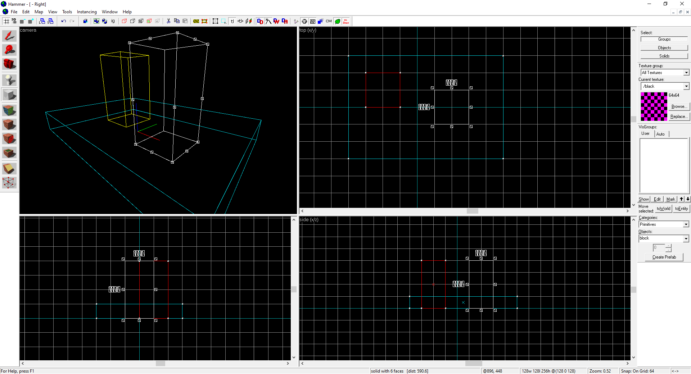
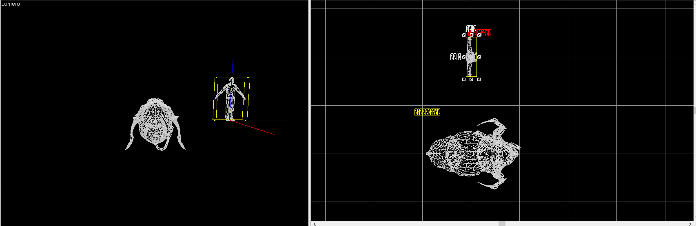

# shaderapivulkan
A [shaderapi](https://developer.valvesoftware.com/wiki/Source_SDK_2013:_Your_First_Shader#Architecture) project aimed at adding Vulkan support to the Source 1 engine.

 

# Status / support

## Source SDK 2013 mods
No.

## [SDK 2013 Hammer](https://github.com/Gocnak/sdk-2013-hammer/)
Sort of. Wireframe only; no shaders, textures, etc. Font rendering is broken.  
Requires drivers with VK_EXT_extended_dynamic_state support at the moment.  

  
  